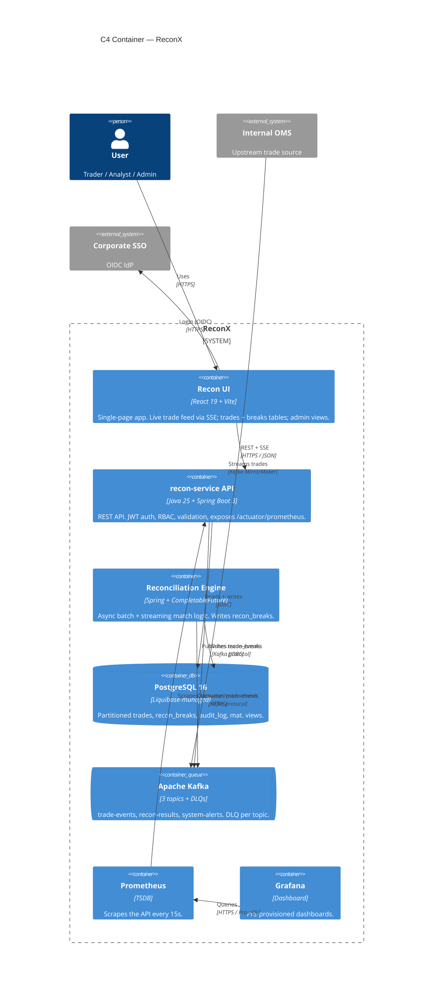

# C4 Container Diagram — ReconX

Level 2 (Container) view: every independently deployable/runnable unit
inside the ReconX boundary, and how they talk to each other. A "container"
here means a process you'd start separately (e.g. via `docker compose up`)
— not a Docker container specifically, and not a Java class.

